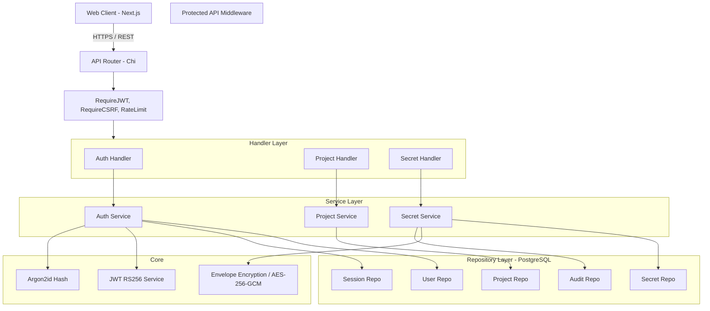

```mermaid
graph TD
    Client[Web Client - Next.js] -->|HTTPS / REST| Router[API Router - Chi]

    subURL[Protected API Middleware]
    Router --> Middleware
    Middleware[RequireJWT, RequireCSRF, RateLimit] --> Handlers

    subgraph Handlers [Handler Layer]
        AuthH[Auth Handler]
        ProjectH[Project Handler]
        SecretH[Secret Handler]
    end

    subgraph Services [Service Layer]
        AuthS[Auth Service]
        ProjectS[Project Service]
        SecretS[Secret Service]
    end

    subgraph Repositories [Repository Layer - PostgreSQL]
        UserR[User Repo]
        ProjectR[Project Repo]
        SecretR[Secret Repo]
        AuditR[Audit Repo]
        SessionR[Session Repo]
    end

    subgraph Core
        Crypto[Envelope Encryption / AES-256-GCM]
        JWT[JWT RS256 Service]
        Argon2[Argon2id Hash]
    end

    AuthH --> AuthS
    ProjectH --> ProjectS
    SecretH --> SecretS

    AuthS --> UserR
    AuthS --> SessionR
    AuthS --> JWT
    AuthS --> Argon2

    ProjectS --> ProjectR
    SecretS --> SecretR
    SecretS --> Crypto
    SecretS --> AuditR
```
