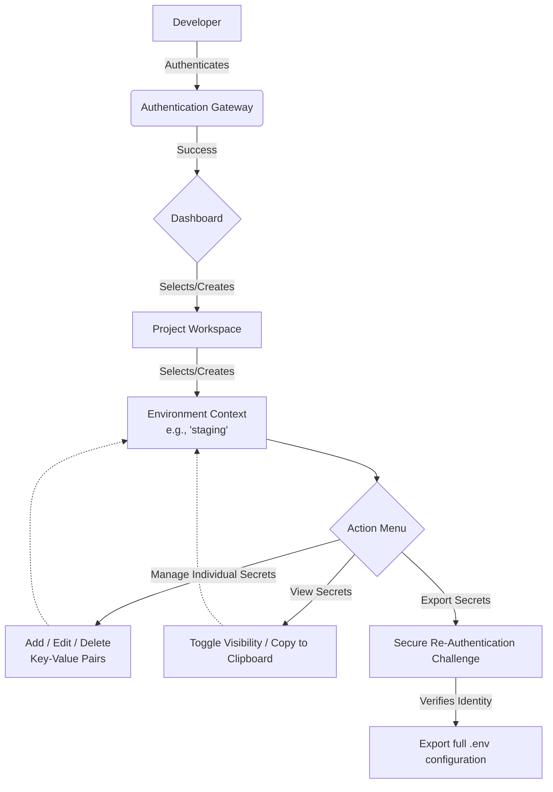

# Env Vault

Env Vault is a secure, centralized environment variable management system designed to streamline the storage and retrieval of configuration secrets across various projects and deployment stages.

## Overview

Modern applications often require different configurations for different stages of their lifecycle (e.g., development, staging, production). Managing these configuration variables—especially sensitive secrets like database connection strings, API keys, and third-party credentials—can quickly become fragmented and insecure if handled through loose `.env` files scattered across developer machines.

Env-Vault solves this problem by providing a unified, secure dashboard to manage all your configuration needs. It enforces structured organization, ensures secrets are encrypted and handled safely, and provides an intuitive user interface built with a premium "Noir Marble" aesthetic.

## Key Features

- **Project-Based Organization**: Group your configuration variables logically by project. Whether you have one monolithic application or dozens of microservices, each project maintains its own isolated workspace.
- **Environment Contexts**: Within each project, create distinct environments (such as `development`, `staging`, `qa`, and `production`). This allows you to use the same configuration keys with context-appropriate values.
- **Secure Secret Management**: Add, update, and remove secrets dynamically. Secrets are obscured by default in the interface to prevent shoulder-surfing and accidental exposure.
- **Bulk Export Capabilities**: Need to pull down the latest production variables for a deployment? Env-Vault allows you to export all secrets for a specific environment into a standard `.env` format directly to your clipboard.
- **Re-Authentication for Sensitive Actions**: Critical actions, such as exporting an entire environment's secrets, require the user to re-authenticate, adding an extra layer of security.
- **Modern Dashboard UI**: Built with a focus on user experience, the dashboard features a responsive, dark-themed, glassmorphic design that makes managing infrastructure feel premium.

## System Workflow

The following diagram illustrates the high-level workflow a developer takes when interacting with Env-Vault:

## How It Works

1.  **Authentication**: Users must log in to access the system. The platform employs session management to ensure only authorized personnel can view the dashboard.
2.  **Navigation**: Upon entering the dashboard, users are presented with a sidebar containing their existing projects.
3.  **Context Selection**: Selecting a project reveals its associated environments. Selecting an environment opens the main secrets table.
4.  **Secret Operations**: In the main view, users can confidently manage their secrets. The UI provides real-time feedback and confirmation modals for destructive actions (like deleting an environment or secret) to prevent accidental data loss.
5.  **Integration**: When a developer is ready to run their application, they can use the "Export All" feature (after passing a security check) to instantly copy all necessary environment variables and paste them into their local `.env` file or CI/CD pipeline variables configuration.

## Architecture Guidelines

Env-Vault is designed with a strict separation of concerns:
-   **Client Application**: A React-based Single Page Application (SPA) that acts purely as the presentation layer. It manages local UI state, routing, and user interactions without persisting sensitive data locally beyond necessary session tokens.
-   **Server Application**: A robust backend service that handles business logic, database transactions, data encryption/decryption, and authorization enforcement.

*Note: Specific implementation details regarding the underlying database, encryption algorithms, and API endpoints are intentionally omitted from this document for security purposes.*
